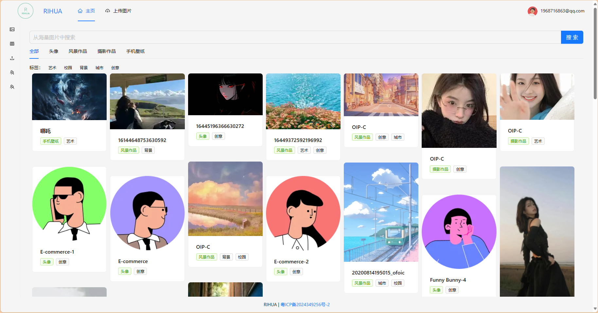
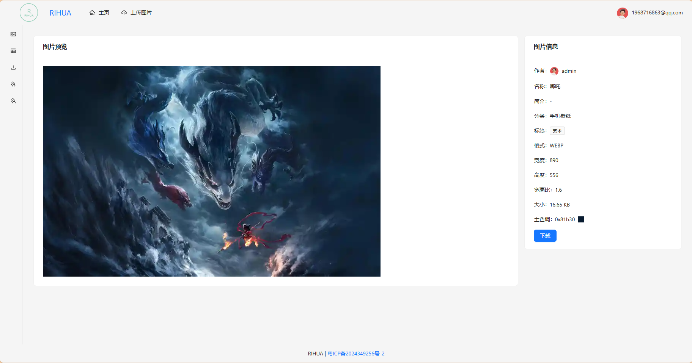
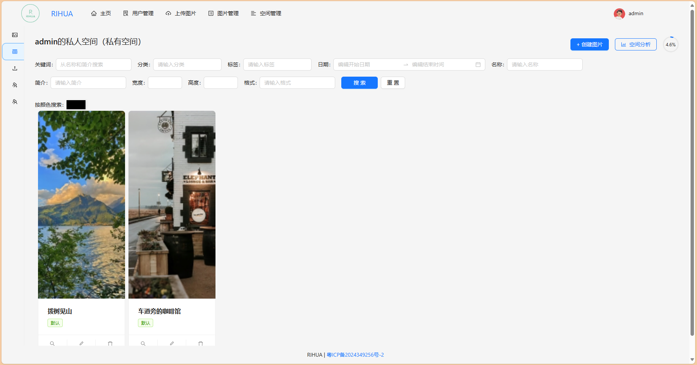
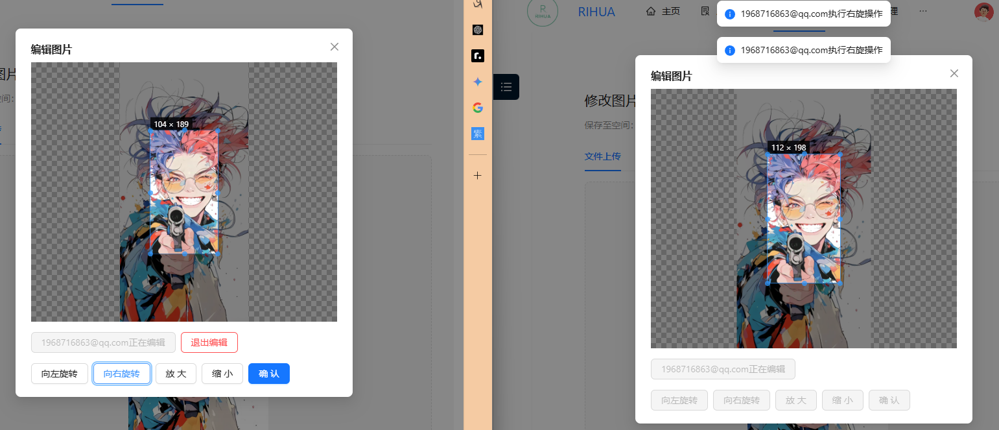

# RIHUA 图库 - 一个面向图片分享与交流的平台

欢迎访问 [RIHUA 图库](https://devcraft.online)，这是一个为用户提供图片分享、存储和协作功能的在线平台。

---

## 🌟 功能介绍

### 1. 用户上传与检索图片素材
- **快速查找所需图片**：用户可以在主页浏览公共空间中的图片资源。
- **登录后查看详细信息**：登录后可下载图片，并通过关键词、分类、日期、颜色等多种方式检索数据。
- **上传图片至公共空间**：登录用户可通过导航栏的“上传图片”入口提交图片，经管理员审核后展示在公共空间中。

---

### 2. 私有空间 - 个人相册
- **创建个人空间**：在左侧侧边栏点击“我的空间”，即可进入或创建专属私有空间。
- **自定义上传图片**：私有空间中的图片仅对本人可见。
- **空间分析功能**：用户可以查看个人空间的使用情况和数据分析。

---

### 3. 团队空间 - 实时协作与共享
- **创建团队空间**：每个用户可以创建一个团队空间，或加入多个团队空间。
- **实时编辑图片**：团队成员可在同一空间内协作编辑图片，提升工作效率。
- **成员管理**：团队管理员可添加/移除成员，并对权限进行分配和调整。

---

### 4. 管理员功能
- **全面管理平台**：管理员负责整个网站的运营，包括图片审核、用户管理和空间分析。
- **自动审核机制**：管理员上传的图片无需额外审核，直接发布到公共空间。

---

## 📋 系统功能分类

### 1. 用户模块
- 登录、注册、重置密码
- 邮箱验证
- 个人主页

### 2. 图片模块
- 浏览、上传、下载图片
- 个人与团队实时编辑图片
- 多条件检索图片
- 接入阿里云AI扩图功能，支持智能扩展图片内容

### 3. 空间模块
- 私人、公共、团队空间
- 团队实时协作编辑图片
- 成员管理（授权、删除）
- 空间内容分析

### 4. 权限模块
- 基于角色的访问控制（RBAC）模型，根据不同用户授予相应权限
- 合理调控用户行为，确保平台安全与高效

---

## 🛠 技术选型

### 后端技术栈
- **框架**：Java SpringBoot
- **数据库**：MySQL + MyBatis-Plus + MyBatis X
- **缓存**：Redis 分布式缓存 + Caffeine 本地缓存
- **对象存储**：腾讯云 COS
- **权限控制**：Sa-Token
- **实时通讯**：WebSocket
- **AI接口**：接入阿里云AI扩图功能

### 前端技术栈
- **框架**：Vue3
- **打包工具**：Vite
- **组件库**：Ant Design Vue
- **请求库**：Axios
- **状态管理**：Pinia
- **工程化**：后端 OpenAPI 自动生成前端代码

---
